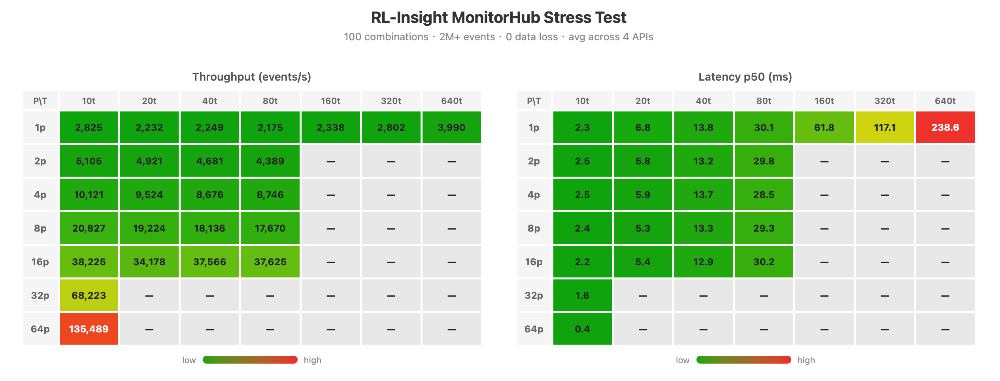

# RL-Insight Monitor Stress Test Report

> Date: 2026-07-07
> Environment: Ray cluster, single MonitorHubActor, Prometheus :9090, Grafana :3000

---

## 1. Key Findings

### 1.1 Data Integrity

Across 100 process × thread combinations and 2 million events, the MonitorHubActor delivered **zero data loss and zero errors**. Counter counts and histogram sums matched Prometheus exactly in every combination tested, including exact-value write-back verification.

### 1.2 Scaling Behavior

- **Throughput scales with process count, not thread count.** Within a fixed process count, increasing threads from 10 to 640 barely changes throughput. Doubling the process count approximately doubles throughput.
- **Latency scales with thread count, not process count.** For a given thread count, p50 latency is nearly identical whether running 1 process or 64. More threads mean deeper Ray actor mailbox queues.
- **All four APIs behave identically.** Counter, gauge, histogram, and trace differ by less than 20% in throughput. The Hub's per-event processing cost is O(1) and dominated by Ray actor scheduling, not API logic.

### 1.3 Throughput Ceiling

At 64 processes × 10 threads, the system reaches approximately **135,000 events/s** (average across all four APIs), with p50 latency of just 0.4ms. Each event costs the Hub roughly 7µs to process. The actor is far from saturated; we estimate the true ceiling around 200–300K/s.

### 1.4 Optimal Configuration

**Few threads, many processes.** 64p×10t simultaneously achieves the highest throughput and the lowest latency. To scale monitoring throughput in production, add reporter processes rather than threads.

### 1.5 Timestamp Drift

Counter, gauge, and histogram timestamps are recorded at Hub processing time, not client invocation time. Under the optimal 64p×10t configuration, p50 drift is negligible at 0.4ms. Under extreme load (1p×640t), p50 drift reaches 238ms. Trace spans always use client-side timestamps and are unaffected.

---

## 2. Test Methodology and Results

### 2.1 System Under Test

Four RL-Insight public APIs:

| API | Type | Prometheus Metric |
|---|---|---|
| `metric_count` | Counter | `rl_insight_monitor_train_step_total` |
| `metric_value` | Gauge | `rl_insight_monitor_reward_mean` |
| `metric_distribution` | Histogram | `rl_insight_monitor_step_latency_ms` |
| `trace_state` | Trace | Tempo span |

### 2.2 Methodology

- **Process levels:** 1, 2, 4, 8, 16 (main grid) + 32, 64 (high-process extension)
- **Thread levels:** 10, 20, 40, 80 (main grid) + 160, 320, 640 (high-thread extension)
- 100 total combinations (4 APIs × 25 process-thread pairs)
- Each combination: 1 second sustained load. Child processes launched via `spawn`, each independently initializing Ray. Thread count equals concurrent workers per process, all running tight loops with no artificial delay.
- Checkpoint after every combination enables resume-after-interruption.
- **Failure detection:** query Hub `events_applied` immediately after the 1s window.
- **Queue time:** p95 − p50, reflecting Ray actor mailbox depth.
- **Data verification:** snapshot Prometheus baseline → exact delta after load, plus known-value write-back verification.

### 2.3 Throughput (avg across 4 APIs, events/s)

| P\T | 10t | 20t | 40t | 80t | 160t | 320t | 640t |
|-----|-----|-----|-----|-----|------|------|------|
| 1p | 2,825 | 2,232 | 2,249 | 2,175 | 2,338 | 2,802 | 3,990 |
| 2p | 5,105 | 4,921 | 4,681 | 4,389 | - | - | - |
| 4p | 10,121 | 9,524 | 8,676 | 8,746 | - | - | - |
| 8p | 20,827 | 19,224 | 18,136 | 17,670 | - | - | - |
| 16p | 38,225 | 34,178 | 37,566 | 37,625 | - | - | - |
| 32p | 68,223 | - | - | - | - | - | - |
| 64p | 135,489 | - | - | - | - | - | - |

Read vertically: throughput is driven by process count. A single process contributes ~2,600 events/s regardless of how many threads it runs. From 1p to 64p, throughput scales roughly 48×. Adding threads within a fixed process count yields less than 50% improvement (1p, 10t→640t).

### 2.4 Latency (avg across 4 APIs, p50, ms)

| P\T | 10t | 20t | 40t | 80t | 160t | 320t | 640t |
|-----|-----|-----|-----|-----|------|------|------|
| 1p | 2.3 | 6.8 | 13.8 | 30.1 | 61.8 | 117.1 | 238.6 |
| 2p | 2.5 | 5.8 | 13.2 | 29.8 | - | - | - |
| 4p | 2.5 | 5.9 | 13.7 | 28.5 | - | - | - |
| 8p | 2.4 | 5.3 | 13.3 | 29.3 | - | - | - |
| 16p | 2.2 | 5.4 | 12.9 | 30.2 | - | - | - |
| 32p | 1.6 | - | - | - | - | - | - |
| 64p | 0.4 | - | - | - | - | - | - |

Read horizontally: latency is driven by thread count. At 10t, p50 ranges from 0.4ms (64p) to 2.3ms (1p)—nearly flat across process counts. At 640t, queue time dominates: 334ms out of 358ms p95 is spent waiting in the Hub's mailbox.

### 2.5 Heatmaps

> Green = low, red = high. The throughput heatmap shows vertical banding (process-driven). The latency heatmap shows horizontal banding (thread-driven).

### 2.6 Data Integrity

| Check | Expected | Actual | Result |
|---|---|---|---|
| Counter exact +5 | 5 | 5.0 | ✅ |
| Counter exact value | 5 | 5 | ✅ |
| Gauge exact value | 7.89 | 7.8900 | ✅ |
| Histogram exact +3 | 3 | 3.0 | ✅ |
| Histogram exact sum | 600 | 600 | ✅ |
| All 100 combinations, failure rate | 0% | 0% | ✅ |

> **2 million events delivered. Exact count and value matching. Zero data loss.**

---

## 3. Grafana Rendering Bottleneck

### 3.1 Official Statement

From Grafana's troubleshooting documentation:

> Source: [Troubleshoot dashboards — Grafana documentation](https://grafana.com/docs/grafana/latest/troubleshooting/troubleshoot-dashboards/)

> "Are you trying to render **dozens (or hundreds or thousands) of time series** on a graph? **This can cause the browser to lag.**"

> "Are you querying many time series or a long time range? Both of these conditions can cause Grafana or your data source to pull in a lot of data, **which may slow the dashboard down.**"

### 3.2 Impact on RL-Insight

- The histogram metric (`step_latency_ms_bucket`) produces **17+ bucket time series per label combination**.
- Under load, a histogram panel may render dozens to hundreds of time series simultaneously.
- `dataproxy.row_limit` defaults to 1,000,000 rows (SQL data sources). Prometheus has no such limit, but browser rendering capacity is far lower.

### 3.3 Comparison

| | MonitorHubActor | Grafana Frontend |
|---|---|---|
| Capacity | 135,000 events/s (unsaturated) | Dozens to hundreds of time series |
| Bottleneck nature | Single-actor serial processing | Browser DOM rendering |
| Scalable | Yes (sharding) | Constrained by browser |

**Hub backend throughput far exceeds Grafana frontend rendering capacity. The stress test bottleneck is in the visualization layer, not the data pipeline.**

---

## 4. Latency Impact on Timestamps

### 4.1 Timestamp Behavior by API Type

| API | Timestamp captured at | Affected by queuing |
|---|---|---|
| `metric_count` | Hub processing time (`Counter.inc()`) | **Yes** |
| `metric_value` | Hub processing time (`Gauge.set()`) | **Yes** |
| `metric_distribution` | Hub processing time (`Histogram.observe()`) | **Yes** |
| `trace_state` / `trace_op` | **Client invocation time** (`time.time_ns()`) | No |

### 4.2 Drift Magnitude

Drift is determined by thread count (i.e., queue depth):

- 10t (low queue): p50 drift ≤ 2.3ms, negligible
- 80t (moderate queue): p50 drift ≈ 30ms
- 640t (extreme queue): p50 drift ≈ 238ms, p95 reaches 560ms

Process count does not affect drift (64p×10t has p50 of just 0.4ms).

### 4.3 Impact on Grafana Display

- Metric panels (counter / gauge / histogram): data point timestamps lag behind actual event time, shifting right on the time axis. Under high thread counts this appears as "data latency."
- Trace panel (state_timeline): timestamps are accurate and unaffected. **This is the reliable source for verifying the true timeline.**

### 4.4 Mitigation

1. Typical RL training uses single-process reporting with low thread counts; drift is 2–3ms and negligible.
2. To increase reporting throughput, add processes, not threads.
3. Grafana dashboards can note "timestamps reflect Hub processing time" for metric panels.
4. When precise timestamps are required, prefer `trace_state` over `metric_value` for recording critical state transitions.

---

## 5. Runtime Overhead in verl Training

Community contributor [@12138flash](https://github.com/12138flash) ran a controlled A/B experiment
measuring the end-to-end training overhead of `rl-insight` on a real verl workload
(PR [#88](https://github.com/verl-project/rl-insight/pull/88)).

**Setup:**

- Hardware: single Ascend 910B4
- Model: Qwen2.5-0.5B-Instruct
- Dataset: GSM8K (GRPO algorithm)
- Logger: `[console, file, rl_insight]`

**Results:**

| Measurement | `rl-insight` disabled | `rl-insight` enabled | Delta |
|---|---|---|---|
| Avg step time (100 steps) | 13.40 s/step | 12.68 s/step | −0.72 s |
| Avg step time (5 steps) | 17.83 s/step | 18.30 s/step | +0.47 s |

Both measurements fall within normal run-to-run fluctuation. The 100-step average
actually came out slightly faster with `rl-insight` enabled — a clear indication that
the monitoring overhead is indistinguishable from experimental noise.

**Conclusion:** the runtime overhead of `rl-insight` in a real verl training loop is negligible.

---

## Appendix: Related Files

- Test script: `tests/monitor/test_monitor_stress.py`
