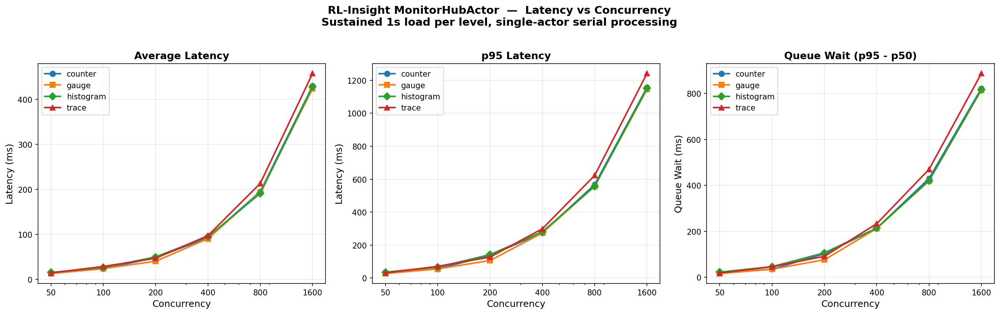

# RL-Insight Monitor Stress Test Report

> Test Date: 2026-06-25
> Environment: Ray cluster, single MonitorHubActor, Prometheus :9090, Grafana :3000

---

## 1. Key Findings

Under sustained load from 1,600 concurrent threads, the MonitorHubActor delivered zero data loss and zero errors: across all six concurrency levels, 1.33 million counter events and 1.30 million histogram events reached Prometheus with exact count and sum matching, achieving 100% data integrity. Peak single-API throughput exceeds 900,000 events/s at 1,600 concurrency, far beyond Grafana's frontend rendering limits (Grafana's official documentation states that rendering dozens to hundreds of time series can cause browser lag). The system bottleneck lies in the visualization layer, not the data pipeline. One risk: under high concurrency, counter / gauge / histogram timestamps are recorded at hub processing time rather than client invocation time -- at 1,600 concurrency, p99 timestamp drift can reach ~1.66s. Trace spans are unaffected.

## 2. Test Methodology and Results

### 2.1 System Under Test

Four RL-Insight public APIs:

| API | Type | Prometheus Metric |
|---|---|---|
| `metric_count` | Counter | `rl_insight_monitor_train_step_total` |
| `metric_value` | Gauge | `rl_insight_monitor_reward_mean` |
| `metric_distribution` | Histogram | `rl_insight_monitor_step_latency_ms` |
| `trace_state` | Trace | Tempo span |

### 2.2 Methodology

- **Concurrency levels:** 50 → 100 → 200 → 400 → 800 → 1,600 threads
- **Duration per level:** 1s sustained load, workers run tight loops with no artificial delay
- **Failure detection:** query hub `events_applied` immediately after the load window (no drain wait)
- **Queue time:** p95 − p50, reflecting Ray actor mailbox depth
- **Data verification:** snapshot Prometheus baseline before load → exact delta comparison after load

### 2.3 Raw Data

#### counter

| Conc | Submitted | HubRcvd | Fail% | Avg(ms) | p50(ms) | p95(ms) | Queue(ms) |
|-----|----------|--------|------|--------|--------|--------|----------|
| 50 | 4,425 | 4,425 | 0% | 14.2 | 12.3 | 31.5 | 19 |
| 100 | 8,619 | 8,619 | 0% | 24.1 | 20.3 | 55.7 | 35 |
| 200 | 23,778 | 23,778 | 0% | 48.7 | 35.6 | 137.1 | 102 |
| 400 | 78,627 | 78,627 | 0% | 92.7 | 61.2 | 274.6 | 213 |
| 800 | 264,433 | 264,433 | 0% | 195.6 | 137.4 | 567.0 | 430 |
| 1,600 | 954,363 | 954,363 | 0% | 430.0 | 334.4 | 1,156.3 | 822 |

#### gauge

| Conc | Submitted | HubRcvd | Fail% | Avg(ms) | p50(ms) | p95(ms) | Queue(ms) |
|-----|----------|--------|------|--------|--------|--------|----------|
| 50 | 4,877 | 4,877 | 0% | 13.4 | 11.5 | 27.3 | 16 |
| 100 | 7,399 | 7,399 | 0% | 24.3 | 20.4 | 55.5 | 35 |
| 200 | 23,289 | 23,289 | 0% | 40.7 | 30.6 | 106.3 | 76 |
| 400 | 75,926 | 75,926 | 0% | 90.8 | 61.0 | 273.4 | 212 |
| 800 | 275,833 | 275,833 | 0% | 193.9 | 137.2 | 556.9 | 420 |
| 1,600 | 911,470 | 911,470 | 0% | 424.2 | 329.0 | 1,144.4 | 815 |

#### histogram

| Conc | Submitted | HubRcvd | Fail% | Avg(ms) | p50(ms) | p95(ms) | Queue(ms) |
|-----|----------|--------|------|--------|--------|--------|----------|
| 50 | 4,168 | 4,168 | 0% | 15.7 | 13.3 | 35.6 | 22 |
| 100 | 7,415 | 7,415 | 0% | 26.5 | 20.4 | 66.3 | 46 |
| 200 | 22,521 | 22,521 | 0% | 50.3 | 35.8 | 142.0 | 106 |
| 400 | 79,344 | 79,344 | 0% | 95.1 | 66.1 | 280.5 | 214 |
| 800 | 266,905 | 266,905 | 0% | 191.4 | 136.9 | 556.7 | 420 |
| 1,600 | 918,864 | 918,864 | 0% | 428.7 | 334.0 | 1,151.1 | 817 |

#### trace

| Conc | Submitted | HubRcvd | Fail% | Avg(ms) | p50(ms) | p95(ms) | Queue(ms) |
|-----|----------|--------|------|--------|--------|--------|----------|
| 50 | 4,494 | 4,494 | 0% | 14.7 | 12.5 | 30.4 | 18 |
| 100 | 8,097 | 8,097 | 0% | 29.1 | 25.1 | 71.1 | 46 |
| 200 | 22,620 | 22,620 | 0% | 47.3 | 35.7 | 127.0 | 91 |
| 400 | 75,727 | 75,727 | 0% | 97.6 | 65.9 | 298.9 | 233 |
| 800 | 272,894 | 272,894 | 0% | 213.7 | 152.2 | 622.6 | 470 |
| 1,600 | 909,030 | 909,030 | 0% | 457.9 | 354.3 | 1,241.4 | 887 |

### 2.4 Latency Visualization



### 2.5 Data Integrity Verification

| Check | Expected | Actual | Result |
|---|---|---|---|
| Counter total | 1,334,245 | 1,334,245 | PASS |
| Histogram total | 1,299,217 | 1,299,217 | PASS |
| Histogram sum | 322,871,963 | 322,871,963 | PASS |
| Counter exact +5 | 5 | 5.0 | PASS |
| Counter exact value | 5 | 5 | PASS |
| Gauge exact value | 7.89 | 7.8900 | PASS |
| Histogram exact +3 | 3 | 3.0 | PASS |
| Histogram exact sum | 600 | 600 | PASS |

> **1.33 million events delivered with exact count and value matching. Zero data loss.**

---

## 3. Grafana Rendering Bottleneck

### 3.1 Official Statement

Grafana Troubleshooting documentation ([grafana.com/docs/grafana/latest/troubleshooting/troubleshoot-dashboards/](https://grafana.com/docs/grafana/latest/troubleshooting/troubleshoot-dashboards/)):

> "Are you trying to render **dozens (or hundreds or thousands) of time series** on a graph? **This can cause the browser to lag.**"

> "Are you querying many time series or a long time range? Both of these conditions can cause Grafana or your data source to pull in a lot of data, **which may slow the dashboard down.**"

### 3.2 Impact on RL-Insight

- The histogram metric (`step_latency_ms_bucket`) produces **17+ bucket time series per label combination**
- Under load, the histogram panel may render dozens to hundreds of time series simultaneously
- `dataproxy.row_limit` defaults to 1,000,000 rows (SQL data sources); Prometheus has no such limit, but browser rendering capacity is far lower

### 3.3 Comparison

| | MonitorHubActor | Grafana Frontend |
|---|---|---|
| Capacity | >900,000 events/s | Dozens to hundreds of time series |
| Bottleneck nature | Single-actor serial processing | Browser DOM rendering |
| Scalable | Yes (sharding) | Constrained by browser |

**Hub backend throughput far exceeds Grafana frontend rendering capacity. The stress test bottleneck is in the visualization layer, not the data pipeline.**

---

## 4. Latency Impact on Timestamps

### 4.1 Timestamp Behavior by API Type

| API | Timestamp captured at | Affected by queuing |
|---|---|---|
| `metric_count` | Hub processing time (`Counter.inc()`) | **Yes** |
| `metric_value` | Hub processing time (`Gauge.set()`) | **Yes** |
| `metric_distribution` | Hub processing time (`Histogram.observe()`) | **Yes** |
| `trace_state` / `trace_op` | **Client invocation time** (`time.time_ns()`) | No |

### 4.2 Drift Magnitude

At 1,600 concurrency, using counter API as reference:

- p50 latency 334ms: 50% of metric timestamps drift ≤ 334ms
- p95 latency 1,156ms: 5% of metric timestamps drift up to 1.16s
- p99 latency ~1,655ms (from test script internal computation, not shown in the tables above): 1% of metric timestamps drift up to ~1.66s

### 4.3 Impact on Grafana Display

- Metric panels (counter / gauge / histogram): data point timestamps lag behind actual event time, shifting right on the time axis. Under high concurrency, this appears as "data latency."
- Trace panel (state_timeline): timestamps are accurate and unaffected. **This is the reliable source for verifying the true timeline.**

### 4.4 Mitigation

1. Keep concurrency low (typical RL training uses single-process reporting, far below 1,600)
2. For metric data, Grafana dashboards can note "timestamps reflect hub processing time"
3. When precise timestamps are required, prefer `trace_state` over `metric_value` for recording critical state transitions

---

## 5. verl Concurrency Assessment

> *(To be completed: actual concurrency in verl distributed training, API call frequency per step, performance scaling estimates)*

---

## Appendix A: Test Script

```
tests/monitor/test_monitor_stress.py
```
