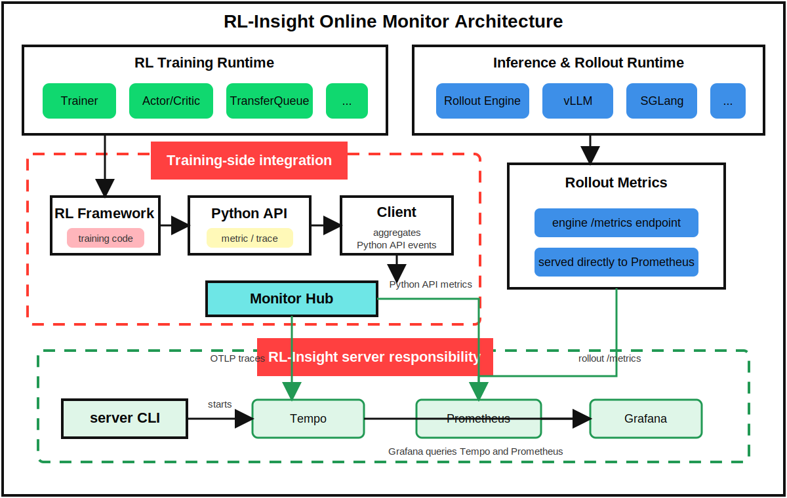

<p align="center">
  
</p>

<h1 align="center">RL-Insight Monitor</h1>

<p align="center">
  Online observability for reinforcement learning training. RL-Insight connects training-side metrics, RL state traces, and service dashboards across distributed rollout and optimization workloads.
</p>

<div align="center">

[](https://deepwiki.com/verl-project/rl-insight)
[](https://github.com/verl-project/rl-insight/stargazers)
[](https://twitter.com/verl_project)
[](https://rl-insight.readthedocs.io/en/latest/)

</div>

## Why RL-Insight Monitor

RL-Insight Monitor focuses on the online observability path that RL training needs most:

- **One-command server startup**: install and start Prometheus, Tempo, and Grafana with `rl-insight server install` and `rl-insight server start`.
- **Trainer and rollout metric aggregation**: collect key actor, rollout, and transfer queue metrics in one monitoring view while keeping training-side instrumentation lightweight.
- **Grafana dashboards for RL workloads**: provide ready-to-use dashboard structure for training metrics, rollout behavior, engine metrics, and RL state timelines.

## Architecture

<p align="center">
  
</p>

The monitor has two data paths. Trainer-side Python API events are aggregated by the client and monitor hub, then exposed to Prometheus or exported to Tempo. Rollout and inference engines expose their own metrics endpoints directly to Prometheus. Grafana queries Prometheus and Tempo to render the RL dashboards.

## Demo

https://github.com/user-attachments/assets/0c9797e7-c0a9-4961-9c8f-1a648f038ada

<p align="center">
  <a href="https://github.com/user-attachments/assets/0c9797e7-c0a9-4961-9c8f-1a648f038ada">Watch the demo video</a>
</p>

## News

- [2026/06/16] RL-Insight officially supports Online Monitor, including one-command server startup, trainer and rollout metric aggregation, and Grafana dashboards for RL workloads.

## Get Started

For the full runnable path, use the dedicated quick start:

```bash
pip install -r requirements.txt
pip install -e .
rl-insight server install
rl-insight server start
```

Then initialize monitoring in training code:

Set the RL-Insight server IP before training workers call `insight.init(...)`:

```bash
export RL_INSIGHT_SERVICE_IP=<server-ip>
```

```python
import ray
import rl_insight as insight

ray.init(address="auto", namespace="rl-insight-monitor")
insight.init(project="verl", experiment_name="ppo-smoke-test")

insight.metric_count("train_step_total", amount=1, worker="trainer_0")
insight.metric_value("reward_mean", value=1.23, worker="trainer_0")
insight.metric_distribution("step_latency_ms", value=42.5, worker="trainer_0")

with insight.trace_state("rollout", state_lane_id="actor_0", step=10):
    run_rollout()
```

Read the step-by-step guide in [Quick Start](./docs/quick_start.md). If you only need the Linux service prerequisites and supported versions, read [Server Installation](./docs/server_installation.md).

## Server Stack

RL-Insight manages three open-source services locally on Linux:

| Service | Purpose | Default port | Required version | Installer version |
|---|---|---:|---:|---:|
| Prometheus | Metric storage and queries | `9090` | `>= 2.30.0` | `2.54.1` |
| Tempo | Trace storage and query API | `3200` | `>= 2.0.0` | `2.6.1` |
| Grafana | Dashboards and trace exploration | `3000` | `>= 13.0.0` | `13.0.0` |

`rl-insight server install` downloads supported Linux binaries into `~/.rl-insight/services`. `rl-insight server start` runs Prometheus, Tempo, and Grafana with data persisted under `~/.rl-insight/data` by default.

## Training API

`experimental/` exports a small public API. The package is re-exported as `rl_insight`, so training code can import one module:

| API | Use |
|---|---|
| `init(project=None, experiment_name=None, config=None)` | Enable monitoring once per process and attach global labels. |
| `metric_count(name, amount=1.0, documentation="", **labels)` | Increment a Prometheus counter. |
| `metric_value(name, value, documentation="", **labels)` | Record the latest value for a gauge. |
| `metric_distribution(name, value, documentation="", **labels)` | Add one sample to a histogram. |
| `trace_state(state_name, state_lane_id=None, **labels)` | Record a named RL state interval. |
| `trace_op(name=None, extra_labels=None, **static_labels)` | Decorate a synchronous function and emit one duration span per call. |
| `finish()` | Reset in-process monitor state. |

Configuration can be passed to `insight.init(config=...)` or through environment variables:

```python
insight.init(
    project="verl",
    experiment_name="ppo-smoke-test",
    config={
        "server": {
            "namespace": "rl_insight_monitor",
            "backend": "ray",
            "service_ip": "10.0.0.8",
        },
        "prometheus": {
            "metrics_report_port": 9092,
            "prometheus_port": 9090,
        },
        "otel": {
            "otel_port": 4318,
        },
    },
)
```

Useful environment variables:

| Variable | Purpose |
|---|---|
| `RL_INSIGHT_SERVICE_IP` | RL-Insight server IP used by training workers to export traces. |
| `RL_INSIGHT_OTEL_PORT` | OTLP HTTP port, default `4318`. |
| `RL_INSIGHT_PROMETHEUS_PORT` | Prometheus HTTP port, default `9090`. |
| `RL_INSIGHT_PROMETHEUS_CONFIG_FILE` | Prometheus config path when the monitor hub updates scrape targets. |

## Documentation

- [Quick Start](./docs/quick_start.md): install RL-Insight, start the services, instrument code, and open Grafana.
- [Server Installation](./docs/server_installation.md): Linux service requirements, supported OS/CPU combinations, and version policy.
- [Default server config](./config/config.yaml): bundled ports, retention settings, and service config paths.
- [Root RL-Insight README](../README.md): offline analysis features and project-level documentation.
## Contribution Guide

See [CONTRIBUTING.md](https://github.com/mengchengTang/rl-insight/blob/8f0dfd8b2b9d9091884f9ff14a2f25bffee9933f/CONTRIBUTING.md).


